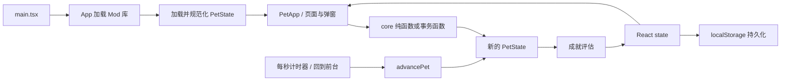

# PocPet CodeWiki

本文是 PocPet 的代码地图和维护参考。功能事实以代码为准，长期有效的约束集中在本文或对应用户指南。

版本以根目录 `package.json` 为准；打包时同步 `src-tauri/tauri.conf.json`、Cargo 与锁文件。

## 1. 项目定位与技术栈

PocPet 是一个离线优先的虚拟宠物应用，同时面向 Windows、Android 和 Web。前端承担主要业务逻辑与本地数据管理，Tauri 负责桌面/移动端容器及文件对话框、文件系统和外部链接等平台能力。

- UI：React 18、TypeScript、Lucide React。
- 构建：Vite 6。
- 原生容器：Tauri 2、Rust。
- 本地状态：`localStorage`。
- Mod 素材：IndexedDB；Mod 清单和启用状态保存在本地存储中。
- 国际化：`src/i18n/zh-CN.json` 与 `src/i18n/en-US.json`。
- 样式：原有 `src/styles.css` 加按功能拆分的 `src/styles/*.css`。

随机玩法和每日结算在本地完成；Toy 版另有平台登录与云存档适配，平台能力通过 `src/platform/` 隔离，不能把普通 Web 与 Toy 的存储行为混为一谈。

## 2. 目录地图

```text
PocPet/
|- src/
|  |- core/          领域类型、规则、迁移、存档、Mod、音频
|  |- ui/            页面、弹窗和展示组件
|  |  `- app/        App 使用的导航与业务 controller hooks
|  |- styles/        拆分后的主题和功能样式
|  |- i18n/          双语资源与翻译函数
|  |- platform/      Web/Tauri 平台差异封装
|  |- mods/          仓库内置示例 Mod
|  |- assets/        图片与音频资源
|  `- main.tsx       React 入口
|- src-tauri/        Tauri/Rust、权限、图标和 Android 工程
|- scripts/          统一存档／报错检查、开发与打包工具
|- docs/             Wiki、操作参考、数值表与素材规范
|- release/          本地交付产物，不提交 Git
`- dist/             Vite 构建输出
```

常用入口：

- `src/main.tsx`：挂载 React 并按固定顺序加载样式。
- `src/ui/App.tsx`：加载 Mod 与存档，组合页面/弹窗，连接 UI 事件和领域函数。
- `src/core/pet.ts`：领域层公共出口；UI 优先从这里导入类型和规则。
- `src/core/petTypes.ts`：`PetState` 及各子系统持久化结构。
- `src/core/petState.ts`：默认存档、主存档规范化和跨版本迁移。
- `src/core/petLifecycle.ts`：时间推进、离线结算、状态衰减与恢复。
- `src/core/storage.ts`、`src/core/saveCodec.ts`：内部存储和外部导入导出。

## 3. 运行时数据流



启动顺序如下：

1. `App` 先读取 Mod 库并加载当前启用 Mod。
2. 根据当前 Mod 构建邻居与可赠送道具上下文，再读取 `pocpet.pet.v1`。
3. 存档通过 `normalizePet` 和 `advancePet` 恢复到当前时间；无存档时进入角色选择。
4. `usePetSession` 每秒调用一次 `advancePet`，窗口重新可见时立即补一次推进。
5. React 状态变化后写回本地存储；成就解锁统一在 `commitPet` 中评估。

领域操作通常接收旧 `PetState` 并返回新对象。涉及扣款、奖励、计数、随机游标或保底的结算必须一次返回完整新状态，不能由 UI 分多次修改。需要防止同一渲染帧重复点击时，沿用 `petRef` 加同步保存的现有模式。

## 4. 领域模块

| 模块 | 责任 |
|---|---|
| `petTypes.ts` | 定义主状态、背包、花园、日程、扭蛋、成就、终局等结构 |
| `petState.ts` | 创建默认宠物，校验旧值，执行兼容迁移和一次性补偿 |
| `petStats.ts` | 等级、属性上限、升级成本、数值钳制和恢复间隔 |
| `petActions.ts` | 喂食、清洁、睡眠、打工、购买、升级、番茄钟等主动操作 |
| `petLifecycle.ts` | 时间推进、离线事件、自然恢复、自动睡眠和每日遭遇 |
| `items.ts` | 内置道具、商店、背包 registry 与 Mod 道具合并 |
| `pomodoro.ts` | 番茄钟状态、阶段时长和奖励计算 |
| `dailyReset.ts` | 每日 05:00 边界和旧日期键兼容 |
| `dailyWishes.ts` | 每日愿望与回归任务 |
| `dateRewards.ts` | 生日、相遇纪念日、节日、月初与登录奖励 |
| `garden.ts` | 花园 schema、树木、工具、照料、成熟和收获 |
| `partnerSchedule.ts` | 候选板、活动快照、技能、结算与迁移 |
| `partnerScheduleEffects.ts` | 日程技能与大师效果 selector |
| `boostCards.ts` | 好友证/挚友证、每日领取和增益消耗 |
| `goldenAppleGacha.ts` | 确定性 RNG、奖池、支付、保底和最近结果 |
| `classicEndgame.ts` | 共同目标、投入、阶段完成、纪念等级和苹果兑换 |
| `classicTrophies.ts` | 奖杯派生状态及跨系统效果 |
| `achievements.ts` | 成就定义、计数、解锁、领取和统计派生 |
| `mod.ts` | Mod zip 与 manifest 解析、约束和运行时模型 |
| `modStorage.ts` | Mod 库、IndexedDB 图片、对象 URL 生命周期 |
| `saveCodec.ts` | 外部存档封装、校验、兼容读取和时间基线重置 |
| `storage.ts`、`cloudSave.ts` | 本地与云端保存、冲突保护和恢复 |
| `community.ts` | 农场设施与社区玩法公共入口 |
| `communityActivities.ts`、`communityProjectData.ts`、`communityProjectActions.ts` | 布告牌周活动、主题条件、分步筹备、邻居回礼与领取 |
| `communityFishing.ts`、`fishingState.ts` | 钓鱼操作、结算与状态兼容 |
| `kitchen.ts`、`kitchenRecipes.ts` | 厨房操作、配方与恢复效果 |
| `adventure.ts`、`expedition.ts` | 手动地标探索、区域挂机与营地 |
| `landmarkProgress.ts`、`landmarkData.ts`、`landmarkAdventure.ts` | 五图四十地标、前置与章节进度、阶段脚本、首通及重复探索 |
| `explorationChecks.ts` | 探索技能判定、心情与消耗计算 |
| `regionalTreasures.ts` | 地区珍宝与装饰基础配方 |
| `audio.ts`、`bgm.ts` | 音效、用户手势解锁、共享 BGM 播放器与音乐陪伴播放状态 |
| `musicCompanion.ts` | 有效聆听进度、固定小心心奖励和存档规范化 |

`src/core/pet.ts` 是公共门面。新增公共能力时在原模块实现并从这里显式导出，避免 UI 深度依赖内部模块。

## 5. 状态、存档与兼容

### 5.1 主状态

`PetState` 是唯一主游戏状态，子系统状态直接挂在其下。新增持久化字段需要同时完成：

1. 在 `petTypes.ts` 定义类型与 schema 字段。
2. 在对应 `default*State` 中给出默认值。
3. 在对应 `normalize*State` 中处理缺字段、非法值和旧 schema。
4. 在 `normalizePet` 中接入子状态。
5. 在 `persistedPet.ts` 的白名单、序列化与回填中接入需要持久化的字段，补齐外部存档版本兼容检查。
6. 必要的旧档、非法输入和重复加载检查合并到 `scripts/check.mjs`。

不要直接信任 `localStorage`、外部存档或 Mod 数据。数字必须处理 `NaN`、负数、越界和非整数；数组必须去重并限制长度；未知枚举值应回退或丢弃，不能让整个存档无法加载。厨房操作 ID、小游戏会话／结算／角色 ID、番茄钟结算 ID 最长 128 字符，相关回执应使用一致的规范化方式。

### 5.2 内部存储

- 主存档键：`pocpet.pet.v1`。
- 语言键：`pocpet.language`。
- Mod 库状态：`pocpet.mod.library.v1`。
- Mod 图片数据库：`pocpet-mods` IndexedDB。

主存档键名保持 `v1` 不代表所有子系统都停留在 schema v1。花园、伙伴日程、扭蛋、增益卡、共同目标等分别维护自己的 schema。

### 5.3 外部存档

外部存档由 `saveCodec.ts` 生成 JSON v2，最低读取版本为 1.9.0；只包含 `persistedPet.ts` 白名单状态及当前 Mod 摘要，不包含 Mod 图片。读取仍兼容旧 JSON、旧 `POCPET-SAVE-v2:` 保护文本与支持的历史来源。新格式不再使用旧可逆变换。

导入时会重置离线时间、能量恢复、睡眠和番茄钟等时间基线，避免恢复旧备份后立即产生大量离线结算。来自更高 schema 或未知冒险规则版本的存档应明确拒绝并提示升级；模块版本保护同时适用于 v2、v1 封装和旧裸存档。

### 5.4 迁移原则

- 迁移必须幂等：同一存档重复加载不能重复退款、发奖或计数。
- 一次性补偿使用稳定的 `claimedRewardIds` 标识。
- 运行时可由现有状态派生的数据不要重复持久化。
- 正在进行的日程、扭蛋结果等应保存结算快照，后续数值调整不追溯改变旧结果。
- 删除字段前至少保留一个可读取旧字段的迁移周期。
- 导出格式、Mod 格式和用户生成内容必须保留 `schemaVersion`、验证规则与失败处理。

### 5.5 玩法状态的维护约束

- 厨房：保留做饭、厨具、摆盘与试吃，研究搭配已移除。制作心心按料理技能及整链预算差额计算，不叠加角色等级／全局产心加成；批量制作与单份累计预算一致，升级料理不得重复领取前序预算。
- 社区服务：进行中的工单保留开始时消耗／奖励快照，扣耗随进度结算；体力不足（含 0）也可接单，扣至 0 后继续完成，结算快照保留筋疲力尽提示，报酬不受影响。提前回家与完整完成分别处理，重复请求不重复扣费或发奖。快速工作与长工单的次数、资源规则分别维护。
- 园艺：施肥互斥／次数、每日高级树减时与单轮状态分别判断；迁移保留付费加速、成熟时间及待领取收获，不复活枯树，不重抽已生成产物。
- 扭蛋：补给箱固定内容直接展开，不增加第二次随机；整份容量校验先于扣费与随机状态推进。保留旧奖项 ID 的历史读取，金苹果按各属性实际有效上限恢复，不套普通料理效果倍率。
- 节日：故事保存年份、版本、开始时伙伴、选项、进度和领奖状态，正文从脚本重建，不保存正文或图片快照。已开始故事可跨活动窗口继续，纪念册回看只读，容量不足保留待领奖励；自然日窗口与凌晨 5 点游戏日分开。
- 冒险：行程保存出发身份、规则版本、随机种子、临时效果和物资；重载不重抽，旧行程及待领取结果不按新数值重算。搬运／兑换／返程原子结算，满仓保留物资，日次数独立于有限长度手账。具体流程见 `adventure.ts`、`expedition.ts` 与共享判定模块。
- 补偿与恢复：已领取标记、待领物资和存档身份稳定；新存档不冒领旧档补偿，失败恢复不覆盖原始备份。迁移账本只校验当前存档的记录；无法核实时保留原记录与待领额度、暂缓补偿，正常进度仍可保存。界面偏好、最近展示结果等临时数据不混入主存档。

数值查询见 [参考索引](README.md) 中的食材、工具和装饰表；实现以对应 `src/core/` 模块为准。

### 5.6 全地图探索与委托

- 地图详情内切换手动／挂机并整理补给，营地建设独立排列；手动到具体地标，挂机保留目标和时长选择。整备和途中各有一个「探索说明」。教学 4 阶段，其余各图每地标为 6／6／8／10／12 阶段；途中复用 40 张正式透明地标图、地区地形与伙伴图层。依赖图、消耗、解锁与奖励共用主线定义，详见[玩法数值表](生产探险道具与珍宝数值表.md)。
- `adventure.landmarks` 保存 40 个稳定地标 ID；新行程规则 10 保存 `nodeId`、`stageIds` 和首次完成标记，旧 `target` 保留兼容。`adventureGathering.ts` 将采集方式解析为原行动：普通／镰刀从原适用条目中等概率抽取，手镐使用原珍宝调查；行程种子、阶段、方式确定结果，预览不结算。记录保存原行动 ID，不扩展存档格式。旧三阶段故事保留旧规则，旧巡路规范化为安全返程待领。
- 新行程绳索与营具直接读取仓库，使用时扣耐久，耗尽扣一件；旧 `tool` 仅保留已预扣绳索的消耗与返还记录。营具在完成路线一半阶段后可用一次，继续推进即错过，教学为第 2 阶段后；`rested` 随存档保存，邻居救援独立。
- 旧章节通关迁成当地所有地标完成，未通关溪谷迁移已有地标，不补发首通奖励。新地区全地标完成后记录章节与水域线索，营地建成才允许挂机。
- 邻居候选为新区、旧区、社区三个槽，生成前同时检查可达性与获取途径；当天新区变化只更新未接的新区槽。任务保存目的地区／地标与锁定奖励，送达实际扣行囊物品，实地任务只认接取之后的阶段事件。
- `expedition.treasurePity` 保存五地独立的 0–9 次未命中计数；新挂机规则 5 的配餐版本 3 每两小时至多结算一次，第 10 次必得。旧挂机继续旧规则，手动调查不重置计数。
- 社区活动每周一游戏当地时间 05:00 在已解锁活动中轮换，本周邀请保持稳定。接取不占每日委托额度；筹备跨周保留，同一活动在旧筹备和回礼结束后才能重接。邀请序号、接受标记、筹备阶段和待领回礼共同持久化；校正未来日期时保留邀请身份与接受标记。随机回礼由存档身份、活动和邀请编号确定，重载不重抽；满仓时心心与物品整份待领。完成次数控制纪念册和旅行日志的共用 CG 解锁，旧档不补发经济奖励。
- 模块版本为 adventure 8、community 12、expedition 5。压缩保存保留新进度、委托目标、保底与待领余额；`scripts/check.mjs` 覆盖迁移、全图物品往返和重复恢复。满仓和满币都保留剩余待领成果。

## 6. 时间边界

项目存在两类日期，不能混用：

- 游戏日：使用 `getDailyResetDateKey`，每天本地时间 05:00 刷新。每日愿望、日程板、商店折扣、邻居礼物、扭蛋券来源等使用此边界。
- 自然日：生日、相遇纪念日、固定节日、月初礼物和季节按本地日历日期计算。

不要自行用 `new Date().toDateString()` 新建每日键。新增日常玩法统一复用 `dailyReset.ts`；现实纪念日则复用 `dateRewards.ts` 的日历工具。系统时间回拨时应保守保留已领取或已判定状态，避免重复收益。

## 7. UI 结构

### 7.1 页面与导航

`useAppNavigation` 管理两类表面：

- 页面：`home`、`achievements`、`garden`、`partnerSchedule`、`commonDreams`、`settings`、`memories`、`festival`、`adventure`、`community`。
- 工具弹窗：`inventory`、`shop`、`boostCards`、`gacha`、`kitchen`、`play`。

`App.tsx` 当前仍是主要编排层。新的复杂业务优先写入 `core` 或 `ui/app` controller hook，不要继续把规则计算堆到 JSX 事件中。

### 7.2 弹窗

新弹窗应复用 `DialogShell`。它负责：

- `role="dialog"`、`aria-modal` 和标题关联。
- 打开后聚焦、Tab 焦点循环、关闭后恢复焦点。
- 多层弹窗栈，只允许最上层响应 Esc。
- 弹窗存在时锁定页面滚动，并在最后一个弹窗关闭后恢复。

背包、商店、增益卡、花园操作和扭蛋复用这一模式。设置是独立页面；修改其他旧弹窗时核对焦点与弹窗栈，避免复制新的弹窗骨架。

### 7.3 样式加载

`src/styles/index.css` 先加载历史 `src/styles.css`，再加载 tokens、base 和各功能样式。后加载的模块化 CSS 会覆盖旧规则。修改样式前必须同时搜索旧文件和模块文件，避免只改到被覆盖的一份。

新样式优先写入对应 `src/styles/*.css`。全局 token 放在 `tokens.css`，基础元素放在 `base.css`，不要继续扩张 `styles.css`。

## 8. 低版本 WebView 兼容规范

背包、商店、设置、确认框、扭蛋详情以及后续所有弹窗都必须兼容项目支持范围内的较低版本 WebView。当前仓库尚未记录一个可验证的最低 WebView 版本，因此不能只凭桌面 Chrome 正常显示就判定兼容；在建立设备矩阵前，关键布局一律采用“旧语法基线 + 现代能力渐进增强”。

### 8.1 JavaScript 与浏览器 API

- `tsconfig.json` 当前语法目标为 `ES2020`，`vite.config.ts` 没有显式 `build.target`。转译不会自动补齐浏览器 API。
- 不直接依赖 `structuredClone`、`crypto.randomUUID`、`Array.prototype.at`、`Object.hasOwn`、原生 `<dialog>` 等较新的 API。确需使用时先做能力检测并提供等价回退，或明确配置构建目标与 polyfill。
- 文件保存、外链、对话框等平台差异必须放在 `src/platform` 或 Tauri 插件封装中，保留普通 Web 下载回退。
- 不使用仅靠 hover 才能完成的操作；触摸设备必须能点击、滚动和关闭。

### 8.2 CSS 基线与增强

关键尺寸先写传统单位，再用 `@supports` 覆盖：

```css
.example-dialog {
  width: calc(100% - 32px);
  max-width: 680px;
  max-height: calc(100vh - 32px);
  overflow-y: auto;
}

@supports (height: 100dvh) {
  .example-dialog {
    max-height: calc(100dvh - 32px);
  }
}
```

固定遮罩保留边缘属性回退：

```css
.modal-backdrop {
  position: fixed;
  top: 0;
  right: 0;
  bottom: 0;
  left: 0;
  inset: 0;
}
```

以下能力只能作为增强，不能成为关键内容可见、可滚动或可点击的唯一条件：

- `dvh/svh`、`min()`、`max()`、`clamp()`。
- `backdrop-filter`、`color-mix()`、container query。
- `aspect-ratio`、flex `gap`、`overflow-wrap: anywhere`、`overscroll-behavior`。
- `env(safe-area-inset-*)`。

使用这些能力时先给出普通宽高、实体背景、边距、换行或安全区为 0 的回退。装饰性模糊失效可以接受，弹窗消失、按钮越界和列表无法滚动不可接受。

### 8.3 弹窗布局规则

- 桌面可以由内容列表滚动；窄屏优先让整个弹窗成为唯一纵向滚动容器，避免 backdrop、弹窗和列表三层嵌套滚动。
- flex/grid 滚动子项必须设置 `min-width: 0` 或 `min-height: 0`，长 Mod 名称、英文单词和大数值必须换行或省略。
- 弹窗高度同时提供 `100vh` 回退和 `100dvh` 增强，并计入顶部/底部安全区。
- 移动端滚动容器保留 `-webkit-overflow-scrolling: touch`；需要时设置 `touch-action: pan-y`。
- 操作按钮不能依赖 `position: sticky` 才可到达；即使 sticky 失效，也应能通过正常滚动看到。
- 禁止用固定内容高度假设文案长度。中文、英文、Mod 自定义名称和系统字号放大后仍需可用。
- 二级弹窗必须继续使用弹窗栈，关闭详情后焦点返回原入口。

背包是弹窗兼容的基准实现：窄屏下切换为单一弹窗滚动，内部列表取消独立滚动，道具行改成两列并让操作按钮换行。以后新增弹窗或改动背包时应保留这一退化路径。

### 8.4 兼容验证清单

弹窗由用户按改动范围人工检查：

1. 420px 桌面窗口和约 390px 手机宽度。
2. 短列表、长列表、空状态和最长中英文/Mod 文案。
3. 仅支持 `vh`、不支持 `dvh` 时仍可完整打开和滚动。
4. `backdrop-filter`、container query、`color-mix()` 失效时内容仍清楚。
5. 软键盘打开、系统字号放大和安全区存在时，关闭与主操作仍可到达。
6. 单层与二级弹窗的 Esc、Tab、返回键、滚动锁和焦点恢复。
7. 触摸滚动不带动背后页面，关闭后页面滚动恢复。

若要承诺某个具体旧 WebView 版本，应先把该版本写入测试矩阵，并在对应 Android 模拟器或真机上完成一次聚焦验证；不要仅通过修改 TypeScript target 宣称兼容。

## 9. Mod 系统

Mod zip 的格式、路径和运行限制以 [mod.ts](../src/core/mod.ts) 的 manifest 类型、资源白名单和校验为准。

代码侧主要边界：

- `mod.ts` 负责白名单路径、manifest 字段、图片大小和自定义道具验证。
- `modStorage.ts` 最多保留 12 个完整 Mod，图片 Blob 存 IndexedDB。
- 自定义道具必须使用 `{modId}:{localId}` 命名空间。
- 存档保留缺失 Mod 的道具数量，但未重新导入对应 Mod 前不可使用或购买。
- 外部存档只包含当前 Mod 摘要，不包含 Mod 库和图片。

新增 Mod schema 时必须继续读取 v1/v2，限制未知文件、路径穿越、过大资源和危险字段；不能让 Mod 改写金币、存档迁移、随机概率等核心规则。

## 10. 国际化与资源

- 日常功能先接中文；英文界面可回退中文并保留已有翻译。英文仅随 1.9.0 这类大版本统一补充，不为翻译单独升版本。
- `t` 返回标量文案，`list` 返回数组，`pick` 用于候选文案。
- JSON key 应按功能域归类，不在组件中复制大段双语常量。
- 图片通过 `assets.ts` 和 Mod resolver 获取；不要在组件中拼接资源路径。
- Mod 可覆盖的资源必须同步解析白名单与对应说明。
- BGM 在 `bgm.ts` 注册，音效在 `audio.ts` 注册；保留用户手势解锁。普通场景隐藏时暂停；音乐陪伴可由用户开启网页／桌面后台播放，安卓保持前台播放。

### 音乐与陪伴

- 所有当前 BGM 的最终 MP3 综合响度为 −18 LUFS（容差 0.3 LU），真峰值不高于 −1 dBTP；保留时长和循环边界。BGM 默认音量 60%，音量与后台开关按本机保存。
- 房间、社区／农场、花园、社区工作在白天共用「房间 → F1 → F2」队列，夜间共用 A3/A4；切换同组页面不重建播放器。商店、睡眠、钓鱼和探险保留专用队列。
- 主页“音乐陪伴”提供全部 11 首的顺序轮播和单曲循环，进入时承接当前歌曲，下一首始终切换歌曲。收起后可通过播放条返回；结束后恢复当前页面的场景 BGM。
- 鉴赏期间的随机姿态只影响展示；实际睡眠、外出、工作和护理优先，养成照常推进。
- 只有实际播放且未静音的鉴赏时间累计奖励；每 120 秒（2 分钟）固定 1 小心心，无每日／会话上限，不受等级和奖励加成影响。结束时一次性领取，余量跨天、跨会话保留。时间冻结期间可听歌但不累计或领取奖励。
- `musicCompanion` 存档模块版本为 1，保存 `pendingListeningMs`，旧档默认为 0；播放状态不持久化，不补算离线听歌时间。实际进度每 5 秒及隐藏、暂停、结束时检查保存；结算与扣除进度同时提交，保存失败不确认领取。导入存档或更换伙伴会解除当前播放会话绑定。

## 11. 常见开发流程

### 新增持久化玩法

1. 在独立 core 模块定义规则和纯函数。
2. 更新类型、schema、默认状态与 normalize。
3. 从 `pet.ts` 导出公共 API。
4. 在 controller hook 或 `App.tsx` 编排调用，UI 只提交意图。
5. 按语言规则更新文案、样式和帮助内容。
6. 存档与异常处理的必要检查合并到统一入口，玩法和交互由人工试玩确认。

### 新增道具

1. 更新 `BuiltinItemId` 与 `items.ts` 定义。
2. 添加图标并更新 `assets.ts`。
3. 确认商店、背包、奖励池、成就与 Mod override 是否需要纳入。
4. 同步 Mod 资源白名单及相关使用说明。
5. 验证旧存档、未知道具与缺图回退。

### 新增弹窗

1. 使用 `DialogShell` 和稳定的 `labelId`。
2. 明确一级/二级弹窗关系和关闭后的焦点目标。
3. 先写低版本 WebView 可用的尺寸、滚动与背景，再添加现代 CSS 增强。
4. 同时验证桌面、窄屏、长文案、空状态和减少动态效果。

## 12. 验证与打包

日常自动检查只有一个入口，代码改动按需要运行一次：

```powershell
npm.cmd test
git diff --check
```

`npm test` 执行 TypeScript、存档往返／迁移／损坏保护／恢复、存储异常、行程持久化与入口模块加载。云端和原生存储使用内存替身，不接触真实玩家存档。它不判断画面、玩法节奏或数值平衡，这些交由用户人工验收。

纯文档、文案和样式改动不例行构建。默认不新增按玩法拆分的自动化脚本；必要的存档和报错用例集中在 `scripts/check.mjs`。同一文件的 `--release`、`--artifacts` 模式仅供打包和 CI 核验版本、架构、内嵌资源与产物集合。固定试玩入口和合成存档见 [本地测试参考](本地测试与复用存档.md)。

打包与发布以根目录 `README.md` 和 `AGENTS.md` 为准。本地默认仅 Windows x64 与 Android arm64（“完整包”同此范围）；32 位须明确要求。所有正式版本标签触发全平台 CI，手动 CI 默认两平台、显式 `full_build` 才全量，不按版本尾号决定。Android 测试包默认 debug keystore，`release/` 不提交 Git；仅本地修改不自动推送、打包或发布。

## 13. 文档维护

文档入口见 [README](README.md)。只保留 Wiki、操作参考、当前数值、格式规范与素材来源；不保留实施记录、测试流水账、美术批次日志、未来规划或路线图。历史实现从 Git 查阅，长期约束合并进现有参考文档。
