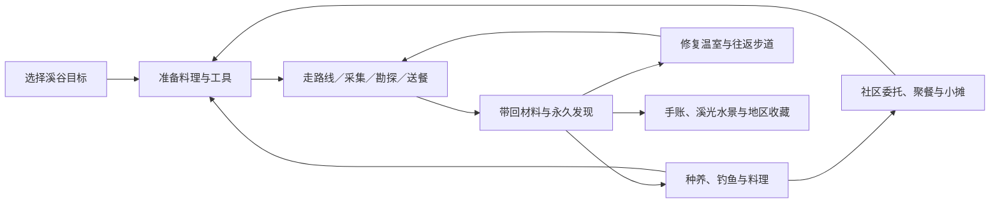

# 溪谷探险循环与收益调整方案

设计基线：2026-09-21 当前工作区，包含尚未提交的食材、工具耐久、地区珍宝与摆摊调整。本文是待实施方案，没有改动玩法代码。已按五棵摇钱树复核，并补充 2／4／8 小时挂机、地区收益梯度与特产收购；细则见《自动探索与地区收购玩法补充.md》，园艺依据见《摇钱树与探险收益复核.md》。公式已复算，节奏与画面仍需人工试玩。

核心建议：解除“完成一次就不能再出发”的限制，把可兑换物资的生成速度与出发次数分开。溪谷完成故事、生产、补给、探索、建设和收藏的闭环。暂不削减摇钱树；溪谷巡路金币按进度设每天 600／1200／2400 三档，挂机领取 80%，与手动共用份额。后续地图提高成本与报酬，农场任务板以常规 3 倍、周期性 5 倍收购引导特产探索。

## 1. 当前实际情况

|项目|当前代码行为|影响|
|---|---|---|
|溪谷入口完整探查|每天一次，凌晨 5 点刷新；6 节点|奖励额度直接锁住路线|
|入口战利品|360／600／1000 金币的物品，按哈希三选一|近似均匀时平均 653.33 金币；直接放开重复获取会放大收入|
|战利品摆摊|金币堆只能兑换；琥珀、金条可按基价 1.2～1.4 倍摆摊|按最高报价，三选一平均价值可达 866.67，不能只算兑换价|
|入口补给消耗|饱食约 300～345、体力 74～98，另计诱饵、苹果或绳索|当前高收益部分由高消耗抵消；不能取消次数限制后照搬奖励，也不能降低消耗却不重算收益|
|七段溪谷故事|一次性，共 225 金币、25 基础心心、木料 15、石料 11，另有种子等|内容和建设材料已经存在，应接起来使用|
|地区勘测|教学后即可进入溪谷，3 个节点完成独立地区故事|与七段故事分开；可提前开放山丘、当地配方与基地，弱化第一章完成目标|
|地区采集|每地区每日 3 次，手动、挂机、调查、勘探共用|手动用完后无法安排有产出的挂机，且下次刷新前没有补充|
|手动采集|一次野菇 2；嫩笋 4；莲子 2；可第一步采完立即返回|不能按“完整行程次数”估算实际产出|
|溪谷珍宝|海蓝宝回收 240，调查 6 点得 1；手镐一次 +2，只占 1 次采集|如果增加普通采集次数，珍宝收益会更快增长|
|挂机 1／3 小时|消耗坚果包 1／2、采集次数 1／3；每小时野菇 1|按坚果包商店原价 28，3 小时成本 56，产物回收仅 30；尚未算状态消耗|
|基地休整|每趟恢复体力 12、健康 6、心情 8；二级步道降低通行成本|无限重开时必须核算整趟净恢复，不能只检查每趟限一次|

来源：`src/core/adventure.ts`、`adventureData.ts`、`adventureItems.ts`、`adventureReturn.ts`、`valleyQuests.ts`、`expedition.ts`、`expeditionData.ts`、`expeditionReturn.ts`、`regionalTreasures.ts`、`communityEconomy.ts`。

## 2. 摇钱树作为经济参照

当前树苗 3000，首次生长 72 小时，后续每轮 36 小时，基础收获 8 次。基础清理费 80，升级铲子后更低。

基础单次收获的近似期望：

`70% × 900 + 25% × 1700 + 5% × 5000 = 1305 金币`

假定成熟立即收获、没有天气／季节／护理／技能／成就／奖杯加成：

`一轮种植寿命 = 72 + 7 × 36 = 324 小时 = 13.5 天`

`长期净收益 = (8 × 1305 - 3000 - 80) ÷ 13.5 ≈ 545.19 金币／天／棵`

这是扣除反复买树苗和清理费后的理论日均，不是每天直接到账 545；未摊销地块和工具投资。随机值按近似均匀分布估计，实际种植时点和收获延迟会影响结果。

应以五棵并种比较玩家的实际收入，而不是把单棵约 545 当作整个探险系统的收入上限：

|五棵的加成条件，不计加速|五棵同轮到账期望|五棵长期净收益／天|
|---|---:|---:|
|纯基础参数对照|6525|2726|
|只计开满五格成就的 20% 额外槽|6851|2919|
|园艺金杯＋开满五格成就|8483|3886|
|钻石＋开满五格成就|9298|4369|
|钻石＋相关成就 70%＋秋季阴天 15%|10358|5012|

前四行清理按 80，最后一行全工具成就对应清理费 40。成就须已解锁；金杯和钻石不同时叠加。最后一行是固定有利环境的对照，不是全年均值。五棵成熟可以同一天集中到账数千甚至上万金币，36 小时的基础再收获周期也不等于每天收一次。

摇钱树每个额外掉落槽是基础金币 +25%，不是翻倍。成就最多还可贡献 70% 额外槽概率；天气、季节、熟练与加速卡也影响产量或速度。丰收营养剂原价 300，基础期望增收 326.25，扣道具后仅增加约 26.25／轮，不能把增产全当净赚。

园艺有 5 个地块，摇钱树没有单独种植数量上限；全开地块 46100＋五棵树苗 15000，初始支出合计 61100，尚未扣一次性奖励。这个投资应有回报，但不能据此把主动探索压到每天两三百金币。改为起步低档、完成营地后中档、持续探索后高档，使新手建设与成熟收益分开增长。

固定有利条件下，叠加园艺熟练与三级水壶、及时浇水收获的五棵模型可达约 6410／天；春季晴天并持续有通行证加速的对照约 7885／天，未扣通行证取得成本。两者都不是全年收入承诺或绝对上限。当前优先提高探索奖励，暂不更改树苗、掉落、周期或五格种植规则；仅削基础掉落 20% 就会令无加成净利润下降约 28.4%，却仍不能解决首版探索收益过低的问题。

来源：`src/core/garden.ts`、`classicTrophies.ts`、`achievements.ts`、`partnerScheduleEffects.ts`、`boostCards.ts`。

## 3. 第一地区的完整循环

保留现有七段故事及其分支顺序，把七处地点变成后续有用途的地方：

|地点／现有故事|首次作用|完成后反复游玩的目的|
|---|---|---|
|水渠：第一滴水|香草、菜地和灌溉线索|采野菇、嫩笋或香草，准备探索料理|
|坡道：旧农舍|鸡舍、牛棚线索|定向找木石，勘探海蓝宝|
|旧桥：那边的来信|钓鱼小屋、送餐交会点|接入现有寻物／实采／送餐委托|
|观景台：风声里的上游|溪谷内的上游步道线索|收集地貌记录、辨认采集点；进入已修好的钓点|
|温室：未完的约定|小摊、野菇焖饭配方|料理供货与社区聚餐|
|石芽：迷路的小客人|伙伴相遇和营地路线|有限的对话分支、物种手账；不重复发首次金币|
|营地：第一盏灯|完成溪谷章节、开放基地建设和自动探索|补给、有限休整、步道升级与下一地区入口|

新存档中，溪谷 `surveyed`、山丘开放和挂机资格由完成“第一盏灯”统一衔接；当地配方可在温室故事提前解锁，便于在本章内形成补给循环。修好休息基地后才开放挂机。取消用另一条三节点路线跳过整章的进度捷径。

旧存档保留已经开放的地区、配方、基地、调查点数、奖杯和库存。迁移后不重新锁住已开放内容；旧勘测记录与章节记录分开保留，未体验的七段故事可继续完成，一次性奖励按各自领取标记判断。

把第一段故事的首次奖励增加香草 ×2，让玩家可以立即做一次暖粥、留下种子种植；第一次闭环不用先等 6 小时收菜。原有香草留种、种植和厨房规则继续承担后续生产。

“溪谷循环完成”的验收条件是：能在溪谷内取得材料，做出补给，再次出发，完成一个委托或聚餐，建设基地并安排一次自动探索，最后能做出一个当地收藏品。无需先去海岸或山丘拿关键材料。

## 4. 出发不限次数，物资按时间恢复

### 4.1 一个清楚的产出预算

取消溪谷入口每日一次的出发封锁，也取消溪谷每日 3 次采集的整日封锁。引入全探索共享的“采集机会”，不按地图分别生成：

|参数|建议初值|
|---|---:|
|恢复速度|每 3 小时 1 点，即长期平均每天 8 点|
|可积攒上限|24 点，约 3 天|
|新玩家首次开放|8 点|
|普通手动采集|1 点|
|徒手勘探|1 点，调查 +1|
|手镐勘探|2 点，调查 +2、耐久 −1|
|自动采集|每完成 1 小时消耗 1 点|
|故事、送餐、已接任务的事实记录、普通走访|不消耗采集机会|

这仍然限制可交易奖励的生成速度，必须在界面明确显示。它不限制地图进入、路线选择或故事推进。不能同时承诺“无次数限制、每次无限获得正收益、长期总收益有上界”；总量控制必须落实到可交易奖励上。

没有机会时仍可完成故事、交付委托、补手账、寻找尚未记录的分支，或进行不发物资的轻松走访。轻松走访不扣额外节点饱食与体力，不发金币、物品、可累积能力加成和重复心心，正常生活时间仍推进。尚未完成的首次故事继续按故事成本与首次奖励执行。

不提供金币购买机会，也不让料理、等级、奖杯或工具直接增加恢复速度。优质补给与工具用于更省状态、携带更方便、选择更多；否则摇钱树金币可以反过来购买探索产能，形成复利放大。

机会跨地图、跨模式、跨溪谷入口、跨短途与长途共用。按实际获得物资的节点扣除，不能完成前几步就重开来绕过预算。机会用完后新增手账只记录有限的新内容，不能把重复次数转成可兑换物资或无限成长。

### 4.2 采集菜单与价值

以下物资在同一次机会中互斥选择，不能沿一条路线把所有菜单奖励都领取一遍。

|目标|手动每 1 点|回收总值|自动每 1 点|回收总值|
|---|---|---:|---|---:|
|野菇|野菇 ×3|30|野菇 ×2|20|
|嫩笋|嫩笋 ×5|30|嫩笋 ×3|18|
|莲子|莲子 ×2|30|莲子 ×1|15|
|香草|香草 ×4|24|香草 ×3|18|
|建材|木料 ×4＋石料 ×3|25|木料 ×3＋石料 ×2|18|
|海蓝宝勘探|调查 +1、野菇 ×1；累计 6 点得宝石 ×1|长期每点 50|不开放|—|

手镐行动花 2 点，得到调查 +2、野菇 ×2，扣一次耐久。它减少操作次数和行程消耗；不会把同一份地区预算的珍宝产量翻倍。原价 120、耐久 12，摊销每次 10 金币。

手动常见物资约是挂机的 1.5 倍，莲子为 2 倍；挂机主打省操作与定向取材。主线、稀有勘探和未发现故事由玩家亲自完成。

所有已有调查余数继续保留。海蓝宝仍值 240，不改旧库存价格。旧的 360／600／1000 战利品保留教学、首次入口和有限收藏里程碑来源；新规则下的重复路线不再生成该三选一宝物。

## 5. 手动探索的长度与反馈

提供“目标短途”和“完整巡路”，不要求玩家为了最后一点材料把整张地图重走一遍。

|路线|内容|建议基础成本|产出预算|
|---|---|---|---|
|目标短途|出发 → 一个目标地点 → 返回|饱食 14、体力 12|普通目标最多 1 点；手镐目标可用 2 点|
|完整巡路|6 节点、两处目标位置，夹入过桥、邻居与故事分支|饱食 30、体力 24|全程最多 2 点；可全部投入一处勘探|
|首次故事|沿用七段既有分支与首次成果|沿用现有逐节点成本|首次材料独立发一次；可选日常采集另扣机会|
|轻松走访|选择已完成地点、回看故事、补记录|不增加节点状态消耗|不产生重复经济奖励|

完整巡路的基础成本可分为饱食 `[4,6,4,6,6,4]`、体力 `[3,6,3,6,3,3]`。空目标位置仍作为巡路节点，不额外发物品。天气和遭遇可以改变选择或在预算内换材料，不额外叠加金币、珍宝抽奖。

建议先做 12 个可记录的支路见闻，分布于七处地点；首次记录推进有限手账页，重复遇见可快速略过。故事、路线发现和收藏以明确的缺项提示引导，避免只有“再点六下”这一种重复动机。

基地休整改为：每趟一次，体力最多恢复 6，且不超过本趟实际消耗、尚未恢复的探险体力；健康最多恢复本趟探险损失的健康，基础上限 3。不能把家中已有的体力／健康缺口通过零成本重开免费补满。轻松走访不生成休整资格。营具仍需扣耐久，恢复同样遵守本趟损耗边界。

步道保留 180 金币＋木 2＋石 3 的升级，降低通行消耗；升级后同样检查“整趟消耗 − 休整 ≥ 0”。心情和心心奖励放在首次见闻与巡路酬谢里，重复休整不再固定增加心情。

## 6. 巡路酬谢与心心

巡路金币按溪谷发展分档，成长来自本地区实际活动，不与持有金币或摇钱树数量挂钩：

|档位|开放条件|每日金币额度|手动完整巡路每份|挂机每 2 个有效小时每份|
|---|---|---:|---:|---:|
|起步|首次进入溪谷|600|150|未开放挂机|
|营地建成|完成七段故事＋修好一级基地|1200|300|240|
|溪谷熟练|营地档＋二级基地＋累计实际消耗 80 点全探索机会＋制成首个溪谷收藏品|2400|600|480|

80 点约为 10 天的自然恢复量，手动与挂机实际消耗都计入，初始赠送的 8 点也计入。预留、退还、重复回执和旧库存不计数。档位只影响奖励，不重新锁住任何路线。已有可信历史计数可迁移，不能凭库存猜测历史次数。

每天有效游戏日凌晨 5 点生成 4 份金币酬谢，每份基础面值为当日档位额度的四分之一。保留最近 3 个有效游戏日，最多 12 份；旧日份额在第三次刷新时到期，新份额正常生成。基础面值在生成时固定，升级不追溯重估；首次发金币时锁定目的地和地区倍率，详见补充方案。

- 手动完整巡路领取一份全额，不要求花采集机会；目标短途不计。优先补同地区部分领取份额，再领未领取全额，优先处理将到期记录。
- 自动探索每完成一个有效采集小时，第一小时累计领该份额的 40%，第二小时累计领到 80%；8 小时最多处理 4 份。剩余差额可在原到期日前通过同地区手动完整巡路补领。
- 熟练溪谷先挂机 8 小时领 1920，再手动 4 趟只补 480，总额 2400。手动先领满后挂机不再加发同一份金币。无可用金币份额时仍按机会结算材料，不能无限保存往日时长兑换未来份额。
- 未领取、已领 40%、已领 80%、已领全额共用唯一记录；部分领取记录计入 12 份上限，过期不扣回已得金币，也不阻止次日生成新份额。界面显示可领、可补及到期时间，不作为背包道具。
- 金币直接入账，不套用摆摊倍率、等级奖励倍率或园艺加成；不通过 360／600／1000 的可交易宝物发放。领取地区锁定后不可换高价地图重新计价。
- 心心独立每天一份 22 基础值、最近三日最多 3 份；手动完整巡路或挂机累计 4 个有效小时可领一份，跨模式共享。既有等级缩放及加成只用一次，不因金币拆成四份而增发心心。
- 旧入口当日奖励已领取时，迁移当天不再生成金币酬谢和心心份额。已在途行程与已有回执按原版本结算一次；其所属日的对应新额度同时占用，不能再拿同一天的新旧两套奖励。

现有完整入口的日常大额宝物与这份酬谢是替换关系。保留旧宝物又新增酬谢，会让本方案的预算失效。首次入口宝物仍保留，首次章节奖励仍独立且不可重复。

自动探索也能领取有界的日常心心，避免忙碌玩家完全停滞；手动优势是全额金币、更高物资产出、珍宝目标、故事和路线选择。已有厨房、委托、聚餐的收益仍按原有来源结算，不混称为探险净收益。

## 7. 自动探索

开放条件：亲自完成溪谷章节并修好休息基地；其他地图挂机还需当地故事与基地。采用类似社区打工的安排卡，显示目的地、时长、收入、物资、费用和预计回程状态，可从收购单直接带入目标。不自动完成未体验故事，不自动钓鱼或勘探珍宝。

|安排|采集机会|野菇目标产出|投入坚果包|口粮原价|熟练档金币|
|---|---:|---:|---:|---:|---:|
|2 小时|2|4|1|28|480|
|4 小时|4|8|2|56|960|
|8 小时|8|16|4|112|1920|

实际时长受机会余额影响，不预支未来恢复。三档每小时金币与材料一致，长程省操作，不另加收益乘数。最多 8 小时一趟，可回来后再安排；控制来自共享预算，不是每日只能安排一次。当前两小时打工在等级 1／20／99、不计季节与加成时为 211／378／1073；溪谷营地档两小时 240、熟练档 480，另有材料，作为相近量级参照，不承诺超过满加成打工。

溪谷每两小时行路另耗饱食 6、体力 6，按实际时间线性结算；2／4／8 小时分别各耗 6／12／24。每段开封口粮仅抵消对应两小时内实际自然饥饿衰减，不修复原有饱食缺口、不恢复体力健康、无剩余恢复可带回。其余自然状态变化继续；出发前预览检查全程状态，危险时保护返程。此为支持 8 小时安排的新规则，不能只改时长却沿用旧口粮逻辑。

挂机不中断摇钱树、已开工生产与摆摊的独立时间。伙伴仍为同一个活动主体，玩家召回后即可手动探索，不要求等倒计时结束。

结算细则：

1. 出发预留采集机会与未开封口粮，按已完成小时兑现物资。预留机会占上限，不能靠反复预留把余额藏到上限外，再等待恢复套利。
2. 每个 2 小时段开始时开封当地口粮并付路费；召回返还未来未开封口粮与未付路费。已开始段费用不退；保留已完成小时收益，未完成小时不发物资、不消耗机会，未使用预留释放。状态损耗按实际经过时间保留。
3. 整点采集与健康越过撤退线同时发生时，先保护返程；没有完成的小时不补发奖励。
4. 一段或多段离线结算结果一致。切前台、换地区、时间冻结与回拨都不能补出第二份同时间产出。
5. 金币按已锁定地区份额的 40%／80% 累计支付目标结算，避免取整和召回重复支付；心心累计 4 个有效小时一份。无对应余额时不存无限已完成时长；换地图不能把低价时长套用高价酬谢。
6. 8 小时野菇为 16 份，嫩笋、香草或建材会更多。回执按本趟目标最大产出完整保留，不套用手动 12 格背包截断；库存满时保留待领取结果。不开无限循环、不自动续程。

这些规则允许随时召回和改玩法，同时防止挂机与手动把一段时间的产出结算两遍。

## 8. 日均收益核算

以下为每天消耗新恢复的 8 点机会、处理 4 份金币酬谢的模型。原材料回收按现价，小摊按最高 1.4 倍逐物品向下取整；小摊一列假定最终都能卖掉，不保证当天到账。首次故事、升级、心心与高价收购均不计入本表。

|档位|手动普通采集净额：回收／最高摆摊|手动勘探净额：回收／最高摆摊|纯挂机 8 小时净额：回收／最高摆摊|
|---|---:|---:|---:|
|起步，每日金币 600|672／768|792／952|未开放|
|营地建成，每日金币 1200|1328／1424|1448／1608|952／1016|
|溪谷熟练，每日金币 2400|2528／2624|2648／2808|1912／1976|

普通采集野菇 24，回收 240／摆摊 336；勘探长期平均海蓝宝 8/6 颗＋野菇 8，回收 400／摆摊 560；实际只发完整宝石、调查余数保留。手镐每天 4 次摊销 40。挂机野菇 16，回收 160／摆摊 224，金币为档位额度的 80%。材料用于建设、料理或订单时不再同时计入普通出售收入。

手动 4 趟共饱食 120、体力 96；有基地恢复体力 24，4 包坚果 112 覆盖基础损耗；无基地按 6 包 168 预算。挂机除口粮 4 包 112，另预留 2 包坚果 56 恢复行路饱食／体力 24，口粮不能再喂一遍。真实支出受初始状态、溢出、技能、天气及自然照料影响；这些是参考预算，不是强制额外扣费。短途不领全额金币，不能套用完整巡路收益表。

熟练档不扣状态补给的原料加酬谢最高摆摊价值：普通采集 2736／天，勘探长期平均 2960／天，扣手镐后 2920。手动补差受同一份额面值限制，额外行程仍花补给；不能把纯手动和纯挂机收益相加。

这不是整个账号的日收入上界：委托、厨房、钓鱼、农场和园艺有各自来源。料理再加工的售价需要扣掉所有额外食材、费用，并保留当前七折采购套利检查；不能把“材料折算价值”和“售出成品收入”重复计入同一天收益。挂机的额外状态补充也需计入实际现金流，不能只用上表毛差额做承诺。

最近三日可集中领取，满额为 24 点机会、12 份金币酬谢。熟练溪谷最多暂存基础面值 7200，挂机包含其中，不额外加发 5760。应满足：`获得机会 ≤ 初始余额 + 经过小时 / 3`，余额加预留不超过 24；金币受份额数量、固定基础面值、锁定地区倍率及三日窗口约束。心心最多 3 份。

熟练溪谷手动约 2500～2800／天、挂机约 1900～2000；加上野菇收购，挂机常规订单日约 2152、急购日约 2392。摇钱树仍独立产出约 2900～6400 的对照收入；高等级地图与订单另外提高探索回报，不能将全账号余额不再增长作为本方案承诺。

## 9. 材料有去处，金币有作用

核心闭环先用现有价格：菜地 160、鸡舍 240、钓鱼小屋 180、小摊 220、基地 120，合计 920 金币、木料 20、石料 10。牛棚、上游步道、二级步道作为后续建设；全部相加为 1820 金币、木料 32、石料 22，不含工具、种子、鱼饵和其他厨房投入。

七段故事已有木料 15、石料 11，仍需要定向建材来源补齐；不能把持续建设完全寄托于每天随机委托。新增木石采集菜单正好把这段接通。

持续消耗分工：

- 野菇＋米做探索补给；嫩笋、野菇、香草做笋菇鲜汤；莲子进入鲜奶羹。出发页面可直接看到缺料和对应采集目标。
- 委托仍是每天接 2 单、接下后不过期；短途可到旧桥完成。已有库存能交的与必须实地完成的任务保持区分，不额外刷新无限高价订单。
- 农场任务板新增独立“特产收购”：每天两个候选、可接一单、最多持有一单；常规按基础回收价 3 倍，每三个有效游戏日有一个候选变成 5 倍急购。接后锁价、不过期，放弃不退当日额度；农场与社区入口共享记录。
- 高价收购指向已开放且采集点可达的地区。例：野菇 ×12 收 360／急购 600，蜂蜜 ×12 收 504／840，松子 ×12 收 648／1080。每单原价货篮不超过 400，货款上限 1200／2000；交货扣真实库存，不叠普通回收或摆摊收入，不把宝石、可种植林莓、商店货物纳入探索高倍池。
- 河岸长桌聚餐增加“溪谷家常”选项：第一阶段野菇 ×2＋嫩笋 ×3，第二阶段野菇焖饭 ×2。完成溪谷章节与第一碗暖粥即可接，不依赖山丘蜂蜜；沿用现有首次 180／重复 30 金币、首次 8／重复 2 心心和每日重复限制，同一项目共用首次标记。
- 溪光水景保留海蓝宝 ×1＋石料 ×3，作为首个全本地收藏目标。琥珀灯提供木石的本地替代配方，避免必须去海岸取海玻璃。
- 琥珀和金条用有限手账里程碑补足收藏来源：首次完成 6 个不同见闻得琥珀 ×1，完成全部 12 个不同见闻及七段故事得金条 ×1；独立一次性领取标记。重复刷新同一见闻不计数，不要求每天抽大额宝物。
- 中期可增加 2000／6000／12000 金币档的温室陈设、路牌套装和收藏展台，搭配已开放的本地材料；仅外观和展示用途。此为后续可选消耗，不是本轮收入测算已包含的金币回收量，也不阻挡主线。

不通过强制每日维修费或给富裕玩家提高价格消化金币。摇钱树的既有投资应有回报，长期金币充裕可以接受；更稀缺的进度来自未体验故事、不同见闻、定向材料与收藏。若未来要求整个账号多年运行仍不积累财富，需要另行核算全系统的持续收入与消耗，单独修改溪谷无法保证。

### 后续地区的消耗与回报

|地区|巡路金币倍率|每 2 小时口粮／路费|熟练档挂机 8 小时金币|含材料回收、扣补给及路费后的参考净额|
|---|---:|---|---:|---:|
|溪谷|1.00|1 包／0|1920|1912|
|风车山丘|1.25|2 包／20|2400|2264|
|雾松林地|1.50|2 包／40|2880|2700|
|潮汐海岸|1.75|3 包／60|3360|3004|
|旧观测站|2.20|3 包／100|4224|3664|

材料目标分别为野菇、蜂蜜、松子、海虾、观测零件，每小时 2 份；以上不含收购溢价。路费、行路状态与手动成本均随地区增加，完整表在补充方案。林地、海岸保持分支开放，不改为串行解锁。全地图共用机会和金币份额，熟练全选观测站时日金币面值最高 5280、纯挂机最高 4224，不是各地图相加。

## 10. 落地顺序与验证

第一步统一溪谷入口、七段故事、配方、基地和山丘解锁；补齐本地建材菜单、第一碗料理与本地聚餐。第二步加入全探索机会恢复、共享酬谢和行程版本，再取消出发封锁。第三步接 2／4／8 小时、旅途口粮、运输与地区成本收益表。第四步接农场特产收购和目的地引导，补见闻内容与缺项提示。

不要先单独删除每日限制，再逐步补奖励预算。关键上线边界：

- 同样经过 72 小时，手动、挂机、混合玩法获得的可用机会总数一致；玩家操作快慢、拆分行程、切入口不增加产能。
- 验证每天 4 份金币、1 份心心的独立生成；先手动、先挂机、跨日补差、份额到期、升级、只挂机超过三天均不多发、不阻断新份额；部分领取的地区倍率不重估。
- 勘探全选、最高摆摊价、最高食物恢复加成、零口粮现金支出分别测算；珍宝进度不因换工具或取消归零，也不免费增长。
- 100 次重复采前返程、零收益走访、基地重开不能产生额外金币、心心、健康、体力或工具。
- 验证满机会预留、恢复、召回、返还的次序；取消不能生成超出 24 的隐藏余额；不同地图不另补一池。
- 离线 1／2／4／8／24／72 小时，整点强退、冻结、回拨、日界线、未领取回执只结算一次；短程多次与长程一次的金币和材料一致。
- 每种挂机目标验证 8 小时实物完整返还；高数量建材与嫩笋不被手动 12 格背包吞掉。
- 旅途餐食只抵该段自然饥饿，不修复旧缺口；状态损耗按实际时间保留。各地图 8 小时均有可负担的口粮、费用与状态条件。
- 验证收购每日接单与三日急购、两个入口共享、跨日锁价、取消不退额度、同批材料不能重复卖；刷新普通板不能刷新高价单。
- 旧存档的开放地区、章节奖励、珍宝余数、在途行程、待领奖励及库存价格保留；迁移当日不重复领取旧宝物和新酬谢。
- 针对等级 1／20／99、有无料理奖杯及技能加成检查完整路线和挂机的补给可行性。表中预算不替代实际状态系统验证。
- 保留现有食材与料理购买、加工、回收和摆摊的套利检查，新增来源也应经过它。

建议人工试玩三种节奏：每天 10～15 分钟；周末集中玩 45～60 分钟；主要安排 2／4／8 小时挂机。验收重点是“今天想继续玩仍有目标”“挂机收入接近普通打工且材料有订单可交”“主动探索仍有更高收益和专属发现”“首次循环不必先去第二地区”。本次未进行截图、Computer Use 或界面自动检查。

跨地区使用全探索每天 8 点机会、4 份金币和一份高价接单额度；地区倍率调整单份回报，不新增整套额度。后续地区剧情仍需展开，本次成本收益梯度是调参起点，不宣称已完成五地区与全年的总经济平衡。
